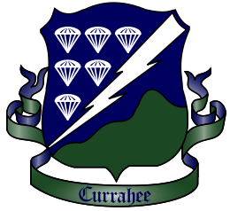

# 506thRecruitingAppPublic
Public Repo for the 506th Recruiting Application, used to track issues and documentation

<!-- highlight the correct badge and ctrl+/ to uncomment -->

<!--  -->

<!--  -->

<!-- PROJECT LOGO -->
 

  

  <h3 align="center">506th Recruting Bot</h3>
  <h4 align="center">Created by Crowxar for the 506th IRRU</h4>

    <a href="https://github.com/Crowxar/506thRecruitingAppPublic/issues/new?assignees=Crowxar&labels=bug&projects=&template=bug-report-%F0%9F%90%9E.md&title="> Submit a bug report </a> or <a href="https://github.com/Crowxar/506thRecruitingAppPublic/issues/new?assignees=Crowxar&labels=enhancement&projects=&template=feature-request-%F0%9F%9A%80.md&title=">Submit a feature request</a>

<!-- TABLE OF CONTENTS -->

  
Table of Contents

  <ol>
    <li> <a href="#about-the-project">About The Project</a></li>
    <li> <a href="#Relevant Links">Relevant Links</a></li>
  </ol>

<!-- About the Project -->
### About The Project
Lorem ipsum odor amet, consectetuer adipiscing elit. Scelerisque litora tristique dignissim curae pharetra facilisis. Pharetra pretium nibh facilisi feugiat ac eu sodales volutpat. Orci purus mi mi posuere vitae. Non torquent tellus ornare dolor velit pretium tincidunt.

<!-- Skills Demonstrated -->
### Relevant Links
...  
...  
...  

(<a href="#readme-top">back to top</a>)

